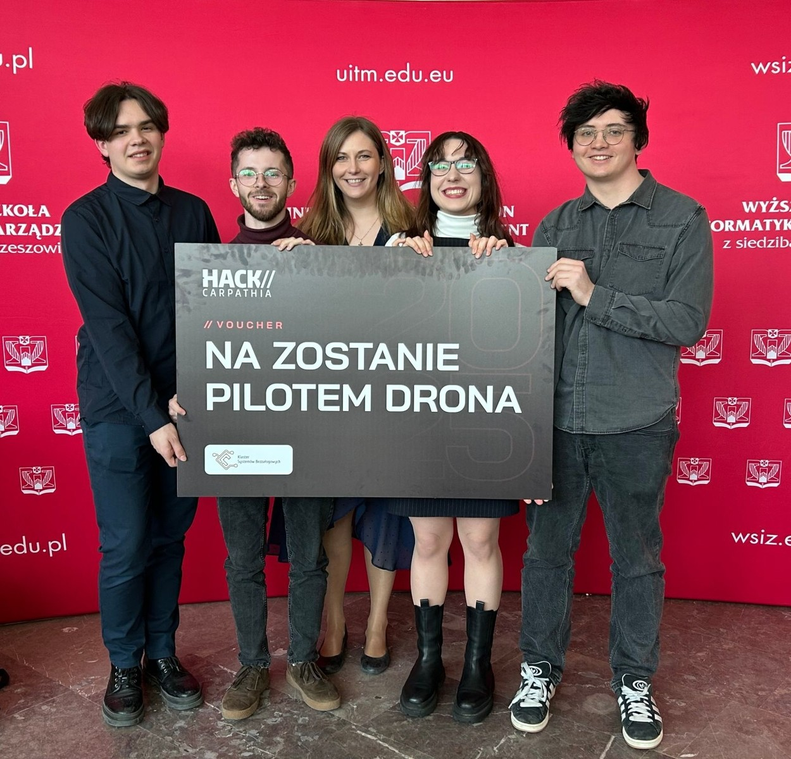
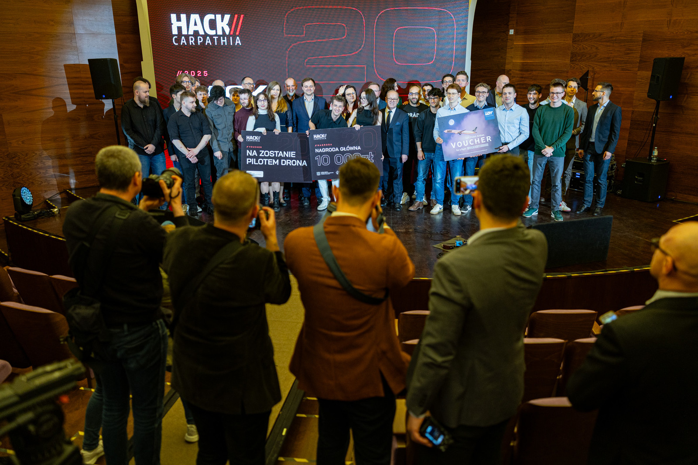
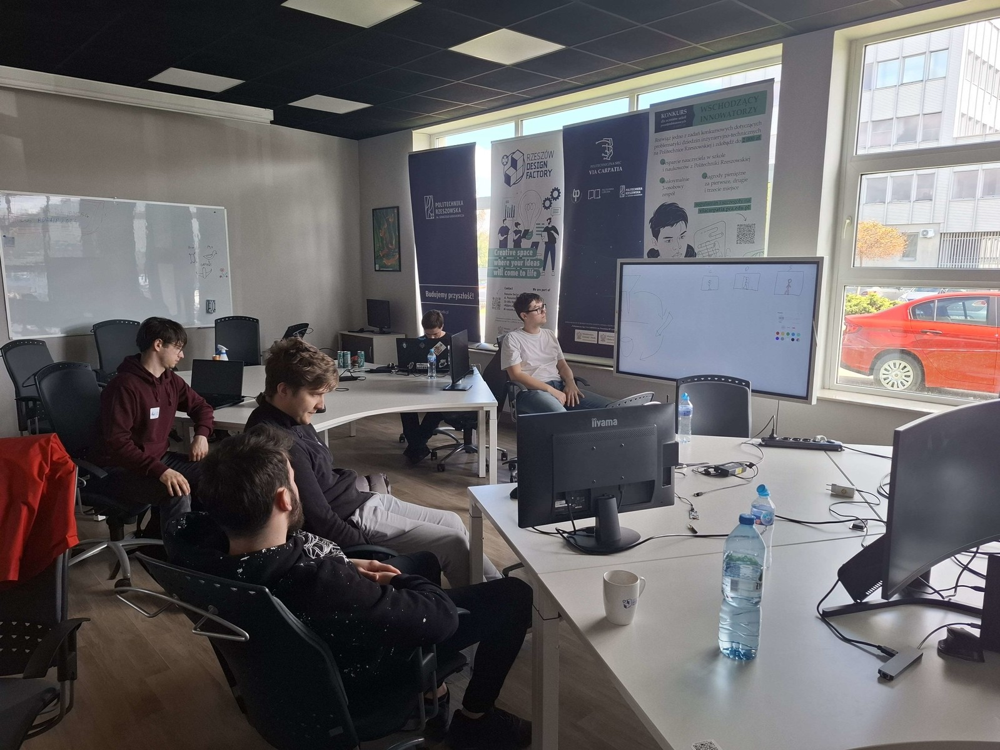
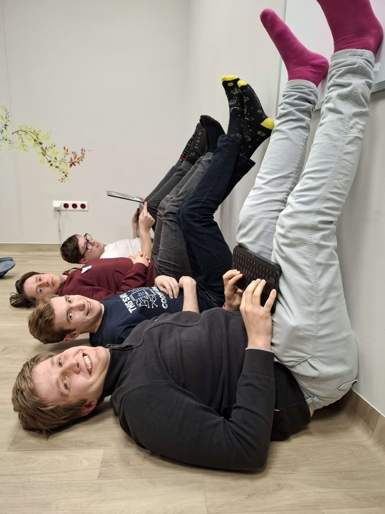

W dniach 12-14 kwietnia 2025 r. odbyła się kolejna edycja maratonu programistycznego **HackCarpathia**, organizowanego przez Wyższą Szkołę Informatyki i Zarządzania w Rzeszowie oraz Podkarpackie Centrum Innowacji.

W tegorocznym hackathonie wzięło udział ponad 200 uczestników z 10 krajów – w tym eksperci i mentorzy. Zgłoszono 50 projektów w ramach trzech głównych kategorii: "Wyzwanie AI LOT", "Wyzwanie Dronowe"oraz "Wyzwania Otwarte", obejmujące cztery podkategorie: Gaming, Sztuczna Inteligencja (AI), Zrównoważony rozwój i ekologia oraz Cyberbezpieczeństwo. Rywalizacja trwała 24 godziny. W wydarzeniu uczestniczyli m.in. członkowie Koła Naukowego Machine Learning Politechniki Rzeszowskiej. Spośród wszystkich zespołów wybrano i nagrodzono najlepsze projekty.

**Zwycięzcą w kategorii "Wyzwanie Dronowe" został zespół w składzie: Magdalena Błażej, Rafał Bazan, Jakub Piasek i Michał Wysocki – studenci kierunku inżynieria i analiza danych** na Wydziale Matematyki i Fizyki Stosowanej Politechniki Rzeszowskiej.

Zespół zaprezentował system oparty na półautonomicznych dronach wyposażonych w sensory wizualne, termowizyjne oraz czujniki dymu. Dzięki zaawansowanym modelom AI, drony analizują dane z czujników, aby wykrywać pożary, a na podstawie danych satelitarnych o pogodzie prognozują kierunek rozprzestrzeniania się ognia. To przełomowe podejście do walki z pożarami.

Więcej informacji można znaleźć na stronie: [https://wsiz.edu.pl/aktualnosci/cyberopiekun-z-mielca-zwyciezca-hack-carpathia-2025](https://wsiz.edu.pl/aktualnosci/cyberopiekun-z-mielca-zwyciezca-hack-carpathia-2025)

Serdecznie gratulujemy naszym studentom i życzymy dalszych sukcesów!

---

*Artykuł opublikowany pierwotnie w [aktualnościach Wydziału Matematyki i Fizyki Stosowanej PRz](https://wmifs.prz.edu.pl/aktualnosci/czlonkowie-kola-naukowego-machine-learning-zwyciezcami-w-hackcarpathia-480.html).*
