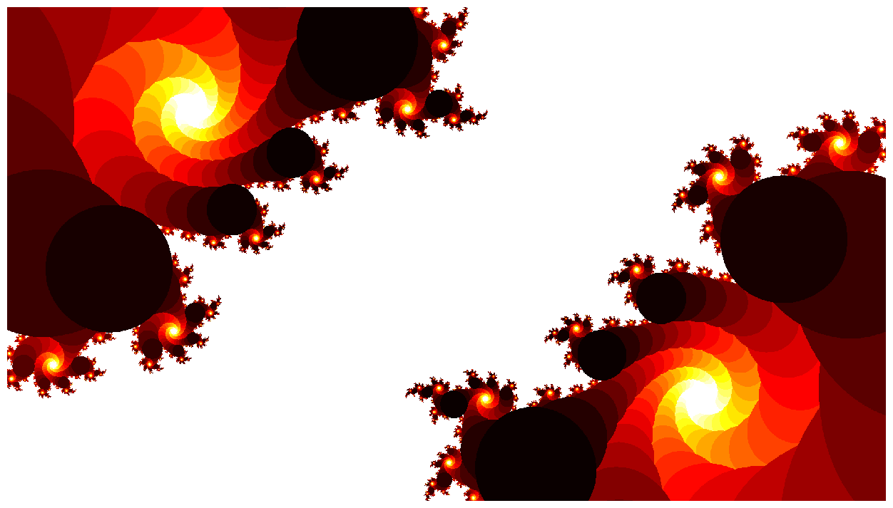
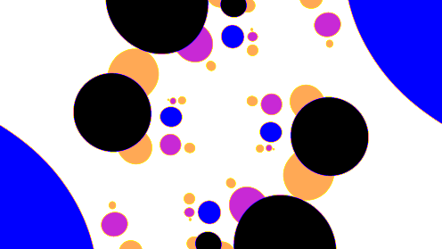
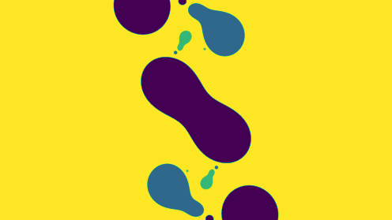
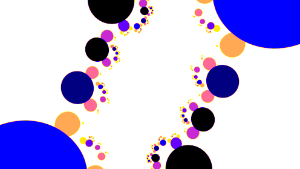
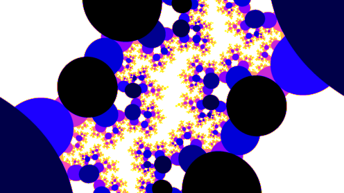
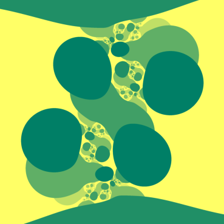
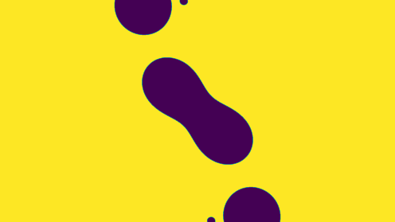
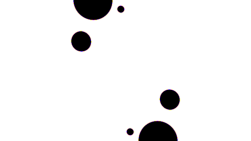

Na HackYeah 2023 czekało na nas sporo ciekawych wyzwań. Zdecydowaliśmy się podjąć temat niezwiązany z analizą danych - „Quantum Art" [^1]. W tym artykule postaramy się opowiedzieć, czego udało nam się dokonać podczas Hackathonu i pochwalić się pięknymi obrazkami i gifami 😀

## Czym jest Quantum art?

Quantum Art to rodzaj sztuki, w której tworzeniu biorą udział komputery kwantowe. Wykorzystuje się przy tym zjawiska takie jak superpozycja kubitów, splątanie kwantowe, czy fakt, iż komputery kwantowe nie są idealne — ich wyniki obarczone są pewnym błędem.


_Julia set stworzony z liczby wygenerowanej przez komputer kwantowy._

Znaleźliśmy kilka sposobów na generowanie kwantowej sztuki, większość z nich wykorzystywała komputer kwantowy jako generator liczb losowych.

Komputer kwantowy może generować liczby losowe poprzez dokonywanie pomiaru prawdopodobieństwa stanów w obwodzie kwantowym. Prawdopodobieństwa te obarczone są pewnym błędem pomiaru — stąd możemy traktować je jak liczby losowe. IBM wykorzystał tę metodę do wygenerowania fraktali [^3]. Postanowiliśmy wykorzystać tę samą metodę do:

1. Wygenerowania fraktali w różnych paletach kolorów.
2. Animacji kolejnych iteracji tworzenia fraktala (patrz obrazek poniżej).


Fraktale, które tworzyliśmy to zbiory Julii [^4]. Do ich generowania wykorzystaliśmy funkcję:

```python
def julia_set2CN1(c0=0, c1=0, height=heightsize, width=widthsize, x=0, y=0, zoom=1, max_iterations=100, save=False, cmap='hot'):

	# To make navigation easier we calculate these values
	x_width = 1.5
	y_height = 1.5*height/width
	x_from = x - x_width/zoom
	x_to = x + x_width/zoom
	y_from = y - y_height/zoom
	y_to = y + y_height/zoom

	# Here the actual algorithm starts and the z paramter is defined for the Julia set function
	x = np.linspace(x_from, x_to, width).reshape((1, width))
	y = np.linspace(y_from, y_to, height).reshape((height, 1))
	z = x + 1j * y

	# Initialize the c's to the complex amplitudes obtained from the quantum circuit
	c0 = np.full(z.shape, c0)
	c1 = np.full(z.shape, c1)

	# To keep track in which iteration the point diverged
	div_time = np.zeros(z.shape, dtype=int)

	# To keep track on which points did not converge so far
	m = np.full(c0.shape, True, dtype=bool)
	for i in range(max_iterations):
		z[m] = (z[m]**2 + c0[m]) / (z[m]**2 + c1[m]) # julia set mating 1
		m[np.abs(z) > escapeno] = False
		div_time[m] = i
		if save:
			# Save as png
			plt.imshow(div_time, cmap=cmap)
			plt.axis('off')
			plt.savefig(f'julia_set2CN1_{i}.png', bbox_inches='tight', pad_inches=0)

	return div_time
```

_Źródło: [Cantorsparadise](https://www.cantorsparadise.com/the-julia-set-e03c29bed3d0)_

## Przykładowe fraktale

Oto przykładowe fraktale, które wygenerowaliśmy:











A oto ich wersje animowane:







## Bibliografia

[^1]: https://hackyeah.pl/tasks-prizes/
[^2]: Treść zadania możecie znaleźć tu: [Details Quantum Art](https://hackyeah.pl/wp-content/uploads/2023/09/DETAILS_QuantumArt_IBM_HackYeah2023.pdf)
[^3]: Artykuł na ten temat: [Creating Fractal Art With Qiskit](https://medium.com/qiskit/creating-fractal-art-with-qiskit-df69427026a0)
[^4]: Zbiory Julii: https://pl.wikipedia.org/wiki/Zbi%C3%B3r_Julii
