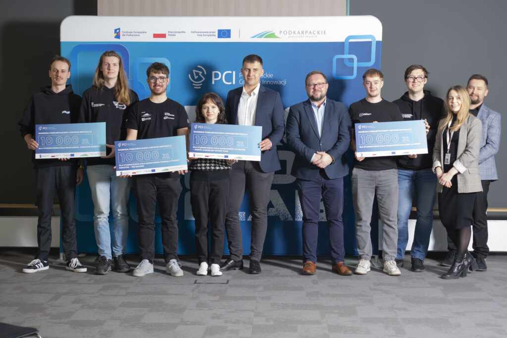

W dniu 8 kwietnia, reprezentanci Koła Naukowego Machine Learning odebrali nagrodę w konkursie dla uczelnianych kół naukowych na najlepsze projekty w obszarze innowacyjnych technologii. Inicjatywa skierowana do studenckich zespołów badawczych miała na celu wyłonienie koncepcji o realnym potencjale wdrożeniowym i naukowym, odpowiadających na aktualne i przyszłe wyzwania technologiczne.

Konkurs został zaprojektowany jako platforma wsparcia dla kół naukowych z podkarpackich uczelni, umożliwiająca rozwijanie nowatorskich pomysłów wpisujących się w Inteligentne Specjalizacje Województwa Podkarpackiego. Uczestnicy przygotowywali projekty pod hasłem „Innowacyjne Rozwiązania Technologiczne Przyszłości”, uwzględniając m.in. poziom innowacyjności, odniesienie do trendów technologicznych oraz potencjał rynkowy swoich koncepcji.

Projekt przygotowany przez Koło Naukowe Machine Learning dotyczący rozproszonej sieci czujników wykrywających drony zyskał duże uznanie, co zaowocowało przyznaniem wyróżnienia oraz nagrody finansowej w wysokości 10 tysięcy złotych. Zdobyte dofinansowanie zespół przeznaczy na dalszy rozwój swoich projektów.

Wsparcie to jest finansowane w ramach projektu „Podkarpackie Centrum Innowacji 2029”, realizowanego ze środków programu regionalnego Fundusze Europejskie.

Studentom z Koła Naukowego Machine Learning serdecznie gratulujemy!

---

*Artykuł opublikowany pierwotnie w [aktualnościach Wydziału Matematyki i Fizyki Stosowanej PRz](https://wmifs.prz.edu.pl/aktualnosci/innowacyjny-projekt-kola-naukowego-machine-learning-nagrodzony-przez-pci-522.html).*
