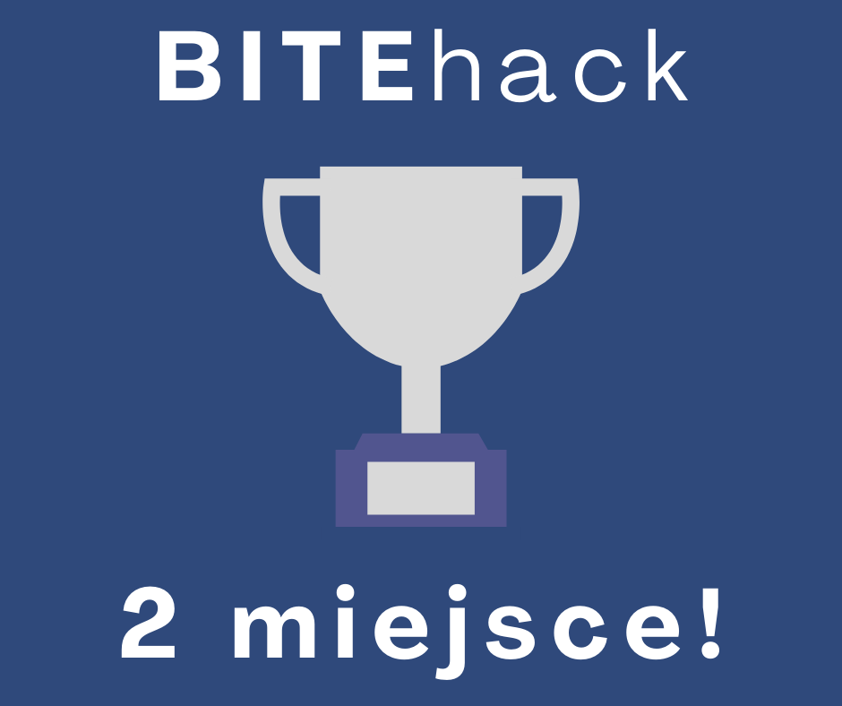

Studenci z Koła Naukowego Machine Learning (ML) przy WMiFS: Patryk Gronkiewicz, Sławomir Jasina, Piotr Krawiec i Hubert Mazur (zespół "Log-Normal People"), zdobyli drugie miejsce w kategorii AI w konkursie programistyczno-robotycznym BITEhack, organizowanym przez Stowarzyszenie Studentów BEST AGH Kraków.

Czwarta edycja konkursu odbyła się w dniach 15-16 stycznia 2022 roku w Klubie Studio, przy Akademii Górniczo-Hutniczej w Krakowie.

BITEhack to konkurs skierowany do studentów. Wydarzenie zakłada wykonanie projektu o zadanej tematyce w ciągu 24 godzin, w zespołach maksymalnie 4-osobowych. W tegorocznej edycji konkursu wzięło udział ponad 120 osób, które zmierzyły się w trzech kategoriach: Klasycznej, Robotycznej oraz AI.

Tematyka konkursu w kategorii AI dotyczyła: "Wykrywania i korekty negatywnych emocji oraz zachowań w sieci".

Zdobyte przez studentów z Koła ML miejsce na podium oznacza w praktyce, iż stworzony przez nich prototyp aplikacji ma potencjał komercyjny.

Serdecznie gratulujemy !!!

---

*Artykuł opublikowany pierwotnie w [aktualnościach Wydziału Matematyki i Fizyki Stosowanej PRz](https://wmifs.prz.edu.pl/aktualnosci/kolejny-sukces-kola-naukowego-machine-learning-311.html).*
