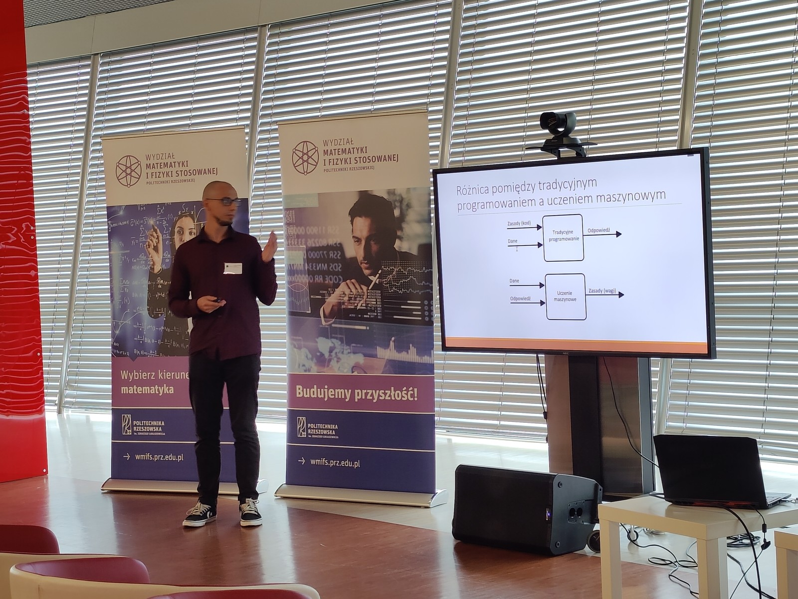
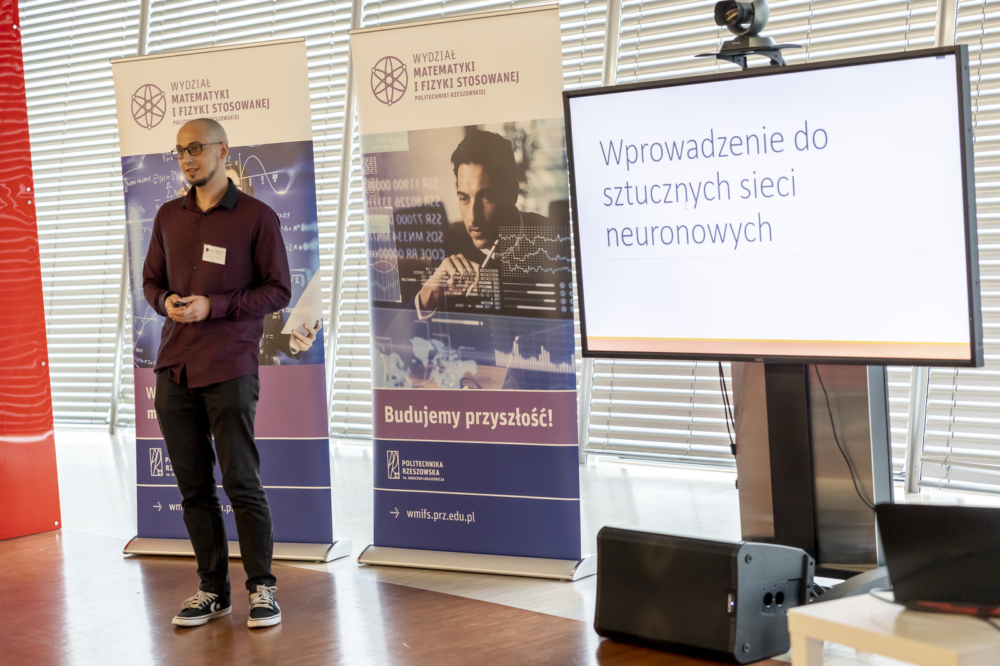
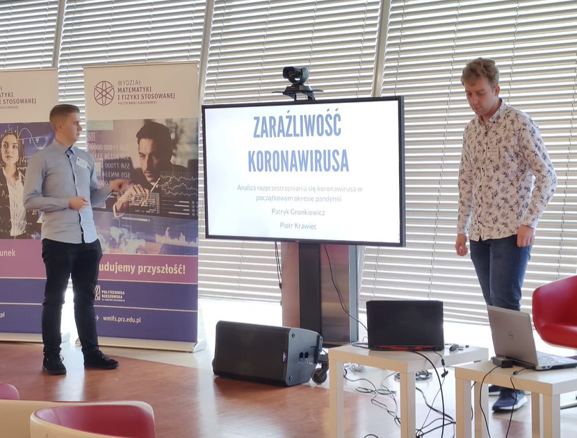
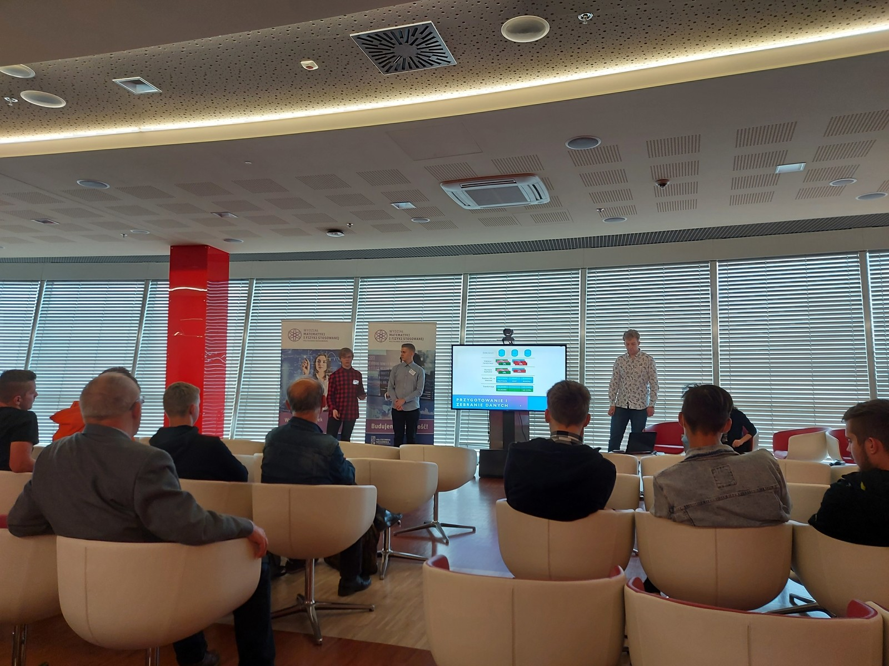
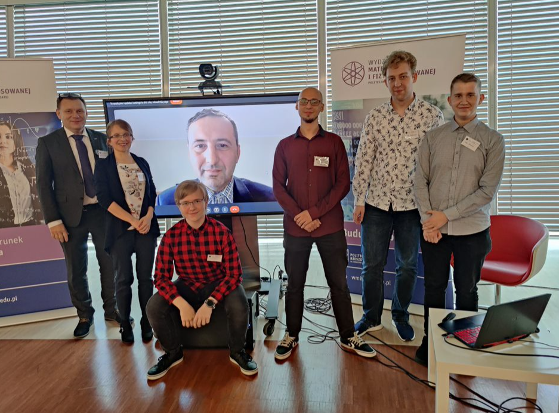

22 września 2021r. w ramach części naukowo-dydaktycznej II Kongresu Edukacyjnego "IT i Szachy", odbyła się sesja panelowa pt.: "Sztuczna inteligencja oraz uczenie maszynowe dla każdego", w której czynny udział wzięli uczestnicy Koła Naukowego Machine Learning, studenci kierunku inżynieria i analiza danych: Patryk Gronkiewicz, Piotr Krawiec, Hubert Mazur i Vitalii Morskyi.

W trakcie panelu studenci mieli okazję podzielić się swoją wiedzą i osiągnięciami zdobytymi m.in. w trakcie hackathonów organizowanych podczas Koła oraz studiów na kierunku IiAD, prezentując odczyty pt.:

"Wprowadzenie do sztucznych sieci neuronowych" - Hubert Mazur,

"Analizy danych w modelowaniu pandemii" - Patryk Gronkiewicz, Piotr Krawiec,

"Przykład prostej lecz innowacyjnej aplikacji Open Gov Data" - Piotr Krawiec, Patryk Gronkiewicz, Vitalii Morskyi.

Ostatni odczyt panelowy pt. "Analizy danych wczoraj i dziś" przedstawił dr Michał Piętal, opiekun Koła ze strony WEiI. Moderatorem panelu była dr Ewa Rejwer-Kosińska, opiekun Koła ze strony WMiFS.

Wszystkie odczyty panelowe spotkały się z dużym zainteresowaniem słuchaczy. Tym bardziej, iż techniki uczenia maszynowego i analizy danych, pomimo, iż wymagają od programisty/analityka interdyscyplinarnej wiedzy i umiejętności i znajdują zastosowania w wielu obszarach codziennego życia.

---

*Artykuł opublikowany pierwotnie w [aktualnościach Wydziału Matematyki i Fizyki Stosowanej PRz](https://wmifs.prz.edu.pl/aktualnosci/kolo-naukowe-machine-learning-na-ii-kongresie-it-i-szachy-282.html).*
