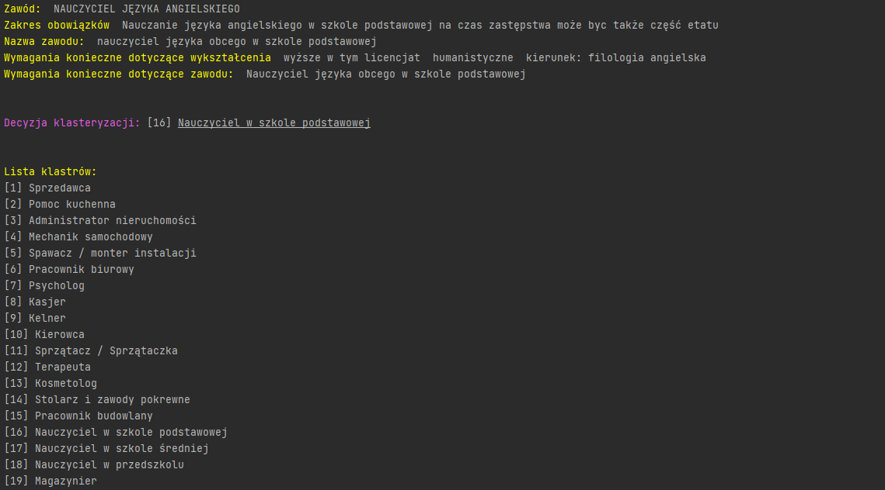

W dniu 22 czerwca br. dobiegł końca Hackathon organizowany w semestrze letnim r.ak. 2020/21 przez Koło Naukowe Machine Learning działające przy Wydziale Matematyki i Fizyki Stosowanej PRz.

W Hackathonie wzięli udział studenci kierunku inżynieria i analiza danych oraz matematyka, łącznie 14 osób. Zadaniem uczestników było stworzenie innowacyjnej aplikacji, na bazie danych publicznych, wykorzystującej algorytmy sztucznej inteligencji i/lub uczenia maszynowego. W toku Hackathonu wyłoniły się trzy Zespoły: RTFD (Read The Finest Documentation), Olimpijczycy oraz Wściekłe Perceptrony.

Mentorami byli opiekunowie Koła Naukowego : dr Ewa Rejwer-Kosińska (WMiFS), dr Michał Piętal (WEiI) oraz dr inż. Marcin Kowalik (WMiFS). Z uwagi na realia pandemiczne, Hackathon odbył się w trybie on-line.

Stworzono trzy niezmiernie innowacyjne oraz posiadające potencjał komercyjny, aplikacje, w których wykorzystano algorytmy uczenia maszynowego/sztuczną inteligencję (w kolejności przyznanych przez Mentorów punktów):

- RTFD: aplikacja poprawiająca bezpieczeństwo surfowania po Internecie,
- Olimpijczycy: nowoczesna, post-pandemiczna aplikacja społecznościowa, przeznaczona głównie dla studentów,
- Wściekłe Perceptrony: aplikacja usprawniająca wyszukiwanie odpowiednich ogłoszeń o pracę z Internetu.

Planowane są dalsze kroki w kierunku komercjalizacji. Kod (w tym: klasyfikatory) pozostaje własnością Zespołów (na mocy Regulaminu Własności Intelektualnej PRz). Na obecnym etapie, aplikacje Zespołów chronione są w ramach ustawy o prawie autorskim i prawach pokrewnych (utwory - programy komputerowe) oraz ustawy o zwalczaniu nieuczciwej konkurencji (know-how).

Mentorzy szczerze gratulują wszystkim Zespołom i życzą dalszego rozwoju aplikacji oraz udanych komercjalizacji!

W kolejnym roku akademickim planowany jest tradycyjnie kolejny Hackathon!

Opiekunowie Koła zapraszają wszystkich chętnych studentów do uczestnictwa w Kole Naukowym Machine Learning od przyszłego roku akademickiego.

---

*Artykuł opublikowany pierwotnie w [aktualnościach Wydziału Matematyki i Fizyki Stosowanej PRz](https://wmifs.prz.edu.pl/aktualnosci/kolo-naukowe-machine-learning---zakonczenie-hackathonu-270.html).*
