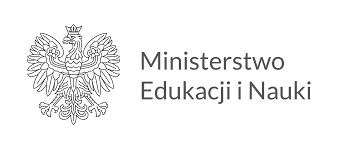

W ramach naszego koła naukowego czasami organizujemy całoroczne hackathony, nasi członkowie zbierają się w grupy i przygotowują aplikacje, które konkurują o tytuł najlepszej. Aplikacja LARKFid powstała właśnie na takim hackathonie.

Naszym celem było stworzenie aplikacji zbierającej, agregującej, przetwarzającej i umożliwiającej dostęp do informacji z twojego regionu. Informacje te mógłbyś dostosować do siebie. Ok, ale co to właściwie oznacza? Rozpiszmy to sobie.

Zbieranie danych z regionu polega na przeszukiwaniu stron internetowych, forów i grup dyskusyjnych z regionu w poszukiwaniu informacji. Przykładami takich informacji mogą być: ogłoszenia o zaginionych psach, dzikach chodzących po ulicach itp. - w skrócie, wszystko.

Agregacja danych to krok który ma połączyć te same inf ormacje, pochodzące z różnych źródeł np. z dwóch portali piszących o tym samym wydarzeniu.

Tak zebrane informacje powinny być przetworzone do jakieś wspólnej postaci zawierającej np. datę i miejsce wydarzenia. I przedstawione w postaci przyjaznej dla użytkownika np. w postaci skrótów wiadomości i pinesek na mapie.

## Implementacja

_Nie będę ukrywać, że po pierwsze nie mieliśmy doświadczenia w tworzeniu tego typu aplikacji, a po drugie: zbyt wcześnie myśleliśmy o skali, o tym jak wiele wiadomości możemy przetworzyć i jak zaprojektować system tak by najpierw działał. Więc to co stworzyliśmy było zdecydowanie zbyt skomplikowane._

Oto cała architektura:
<image src="larkfid-arch.png" alt="Architektura aplikacji LARKFid" />

> Btw. to, że architekturę aplikacji tworzą małe serwisy (które można by nazwać mikro), wcale nie oznacza, że architekturą tej aplikacji są mikroserwisy. Wręcz przeciwnie, architektura LARKFid to monolit, gdyż zależności między kolejnymi serwisami są bardzo duże (wszystkie serwisy tworzą jeden potok danych).

Jej podstawą jest message broker - RabbitMQ. Jego zadaniem jest przekazywanie wiadomości między serwisami.Pierwszą częścią architektury jest "scheduler" i "rss-downloader", odpowiadają one za pobieranie danych z feedów RSS i indeksowanie linków do artykułów w nich zawartych.

Następnym krokiem jest wydanie zadania do zindeksowania danego artykułu (z wcześniej zindeksowanego linku), zadanie to wykonuje "Article downloader". Po pobraniu artykułu dodatkowo wydobywa on z niego treść przy wykorzystaniu Readability od Mozilli.

Ostatnim krokiem jest utworzenie wektorów z wydobytych tekstów (embeddings), które posłużą później do wykonywania zapytań przy wykorzystaniu języka naturalnego. Silnikiem tych zapytań jest OpenSearch KNN Plugin. (Artykuł na ten temat stworzyłem tu: [How to use OpenSearch k-NN as a semantic search engine ](https://dev.to/finloop/how-to-use-opensearch-k-nn-as-a-semantic-search-engine-je9)). Oto przykładowa interakcja z wyszukiwaniem z wykorzystaniem kNN:

```
Query: healthy breakfast
[{'_id': 'WigKpoIBm1k5Fu0Qp171',
  '_index': 'recipes',
  '_score': 0.8946137,
  'fields': {'description': ['a healthy breakfast option'],
             'id': [259963],
             'name': ['spinach toast']}},
 {'_id': 'biUApoIBm1k5Fu0Qu3bT',
  '_index': 'recipes',
  '_score': 0.85431683,
  'fields': {'description': ['yummy healthy breakfast'],
             'id': [156942],
             'name': ['apple pancake bake']}}]
```

Dodatkowo poprzez serwis OpenSearch Dashboards użytkownik ma możliwość bezpośredniego przeszukiwania bazy danych.

I na tym zakończyliśmy implementację w ramach projektu. Jak mogłeś/as zauważyć, nie jest ona kompletna.

## Podsumowanie i wnioski

Niestety, projekt ten nie został ukończony, głównie ze względu na brak zasobów ludzkich (informacja z dnia 20.08.2023). Jednak jeżeli jesteś członkiem koła i zainteresował Cię ten projekt napisz do @finloop na discordzie koła.

Jeżeli projekt byłby reaktywowany, to prawdopodobnie zostałby napisany od zera przy wykorzystaniu wiedzy, którą zdobyliśmy budując wersję pierwszą. Skupili byśmy się na:

1. Nieideksowanych przez przeglądarki danych np. z grup na Facebooku, Instagrama I Tiktoka. Ciekawy artykuł jak to robić znalazłem tu: [Jak pobierać dane z grup na FB](https://blog.apify.com/scrape-facebook-groups-data/).
2. Agregacji danych pochodzących z różnych źródeł.
3. Wyciąganu z tych danych informacji o wydarzeniu, lokalizacji i czasie.
4. Przetwarzaniu tych informacji do postaci przyjaznej dla użytkownika.

Projekt ten przygotowano w ramach realizacji projektu pt.: „Hackathon Open Gov Data oraz stworzenie innowacyjnych aplikacji, z wykorzystaniem technologii GPU”, dofinansowanego przez Ministra Edukacji i Nauki ze środków z budżetu państwa
w ramach programu „Studenckie koła naukowe tworzą innowacje”.

<div style="text-align:center">
  
</div>
