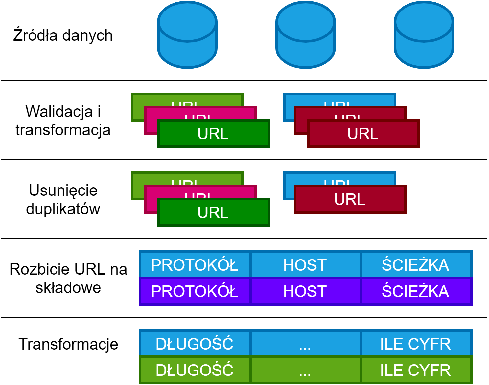
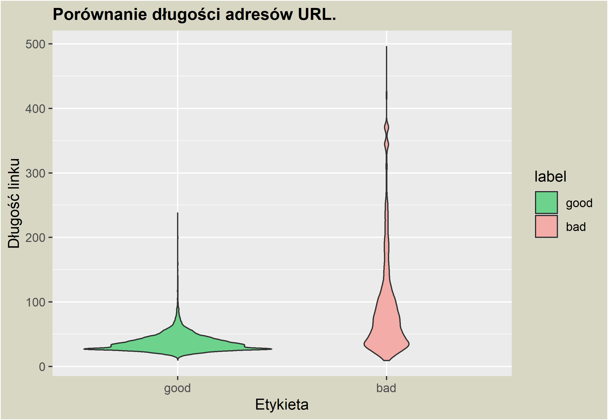
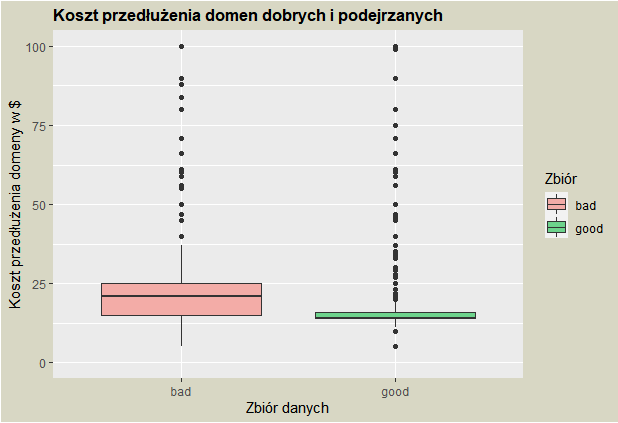
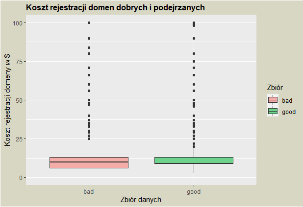
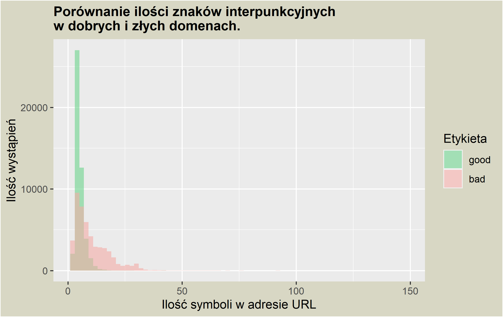

Phishing to atak oparty na wiadomościach e-mail lub SMS. Przestępcy internetowi próbują oszukać i wymusić na ofierze działania zgodne z ich oczekiwaniami. Nazwa tego ataku nie bez powodu kojarzy się z wędkarstwem. Przestępcy, tak jak wędkarze stosują odpowiednio dobraną ”przynętę".

Zjawisko phishinngu w Internecie staje się coraz powrzechniejsze. W roku 2023, 83% organizacji zostało ofiarami ataków phishingowyh [^1]. Phishing ewoluje i staje się coraz bardziej wyrafinowany, a atakujący zysują narzędzia takie jak LLM, czy Diffusion Models, które pozwalają szybciej i łatwiej tworzyć treści. W tym artykule przedstawimy projekt, który ma na celu wykrywanie złośliwych adresów URL, takich, które mogą pojawić się w jednej z wiadomości. W tym celu wykorzystamy uczenie maszynowe. 

*Oryginaly artykuł napisany przez RTFD i r-lab-project w roku 2021. Uzupełnienie i tumaczenie: Piotr Krawiec*

*Projest został stworzony wyłącznie w celach edukacyjych i nie stanowi profesjonalnego narzędzia do wykrywania złośliwych adresów URL.* 

## Wstęp

Głównym założeniem naszego projektu była analiza adresu URL pod kątem niebezpiecznych kombinacji znakowych. W projekcie wykorzystane zostały następujace zbiory danych:

- [CERT Polska : Lista ostrzeżeń przed niebezpiecznymi stronami](https://hole.cert.pl/schema/certpl_lista_ostrzezen_api_v1.pdf)
- [Wykaz stron internetowych podmiotów publicznych](https://www.gov.pl/web/dostepnosc-cyfrowa/wykaz-stron-internetowych-podmiotow-publicznych)
- [Alexa Top 1 Million Sites](https://github.com/mozilla/cipherscan/tree/master/top1m)
- [URL categorization](https://data.world/crowdflower/url-categorization)
- [DMOZ URL Classification Dataset](https://www.kaggle.com/shawon10/url-classification-dataset-dmoz)
- [PhishTank](http://phishtank.org/index.php)
- [Artists Against 419](https://db.aa419.org/fakebankslist.php)
- [URL dataset (ISCX-URL2016)](https://www.unb.ca/cic/datasets/url-2016.html)
- [Kaggle Labeled Url Dataset](https://www.kaggle.com/teseract/urldataset)
- [PhishStorm - phishing / legitimate URL dataset](https://research.aalto.fi/en/datasets/phishstorm-phishing-legitimate-url-dataset)
- [Dataset of Malicious and Benign Webpages](https://data.mendeley.com/datasets/gdx3pkwp47/2)
- [OpenSRS Domain Pricing](https://opensrs.com/services/domains/domain-pricing/)
- [OpenFish](https://openphish.com/)
- [The Moz Top 500 Websites](https://moz.com/top500)

Zbiory te składają się z adresów URL, przyporządkowanych do jednej z dwóch kategorii: złośliwej lub niezłośliwej. 

## EDA

Ponieważ nie każda ze stron w zbiorze danych nadal istnieje, a pobieranie zawartości tych, które istnieją nie jest bezpieczne, zdecydowaliśmy się korzystać wyłącznie z adresu URL do klasyfikaji stron. Każdy adres został rozłożony na następujące części:

- protkół (schemat)
- nazwa domeny
- ścieżka
- parametry
- fragment

A dla każdej z tych części, obliczone zostały statystyki. Proces ten zilustruje poniższy schemat:

### Statystyki

## Referencje

[^1]: [50+ Phishing Statistics You Need to Know – Where, Who & What is Targeted](https://www.techopedia.com/phishing-statistics)
