Nasze koło chętnie uczestniczy w wydarzeniach organizowanych na Politechnice Rzeszowskiej m.in. poprzez przygotowywanie stoiska z ciekawymi, interaktywnymi demami pokazującymi możliwości uczenia maszynowego. Podczas Kolażu Kół Naukowych jednym z takich dem było rozpoznawanie narysowanej cyfry.

# Wykonanie

Całą aplikację stworzyliśmy w języku Python. Jest to jeden z najpopularniejszych języków używanych do analizy danych oraz uczenia maszynowego. Dodatkowo, dzięki wsparciu modułów takich jak Streamlit czy Gradio, możliwe jest tworzenie prostych interfejsów.

Demo można podzielić na dwie części: model i interfejs.

## Model

Postanowiliśmy użyć konwolucyjnej sieci neuronowej, ponieważ same sieci neuronowe są popularnym wyborem przy problemie klasyfikacji cyfr, a konwolucja często ułatwia zadania związane z przetwarzaniem obrazów.

### Konwolucja

Konwolucja (lub inaczej splot) polega na pewnego rodzaju kompresji informacji z kilku punktów (lub, jak w naszym przypadku, pikseli) za pomocą sumy ważonej:

Powyższa animacja pokazuje jądro konwolucji, które "przesuwa" się po dwuwymiarowej macierzy, mnoży wartości komórek przez wagi, sumuje je i zapisuje wynik w innym miejscu. Najczęściej skutkuje to macierzą mniejszą niż oryginał (choć zmiana parametrów konwolucji może wpłynąć na końcowy rozmiar).

Artykuł[^1], z którego pochodzi animacja, świetnie opisuje cały koncept.

Podczas przeprowadzania konwolucji obraz traktuje się jak macierz, której komórkami są kolorowe piksele. Obraz można zapisać jako trzy macierze RGB (jedna dla każdego z kanałów) lub macierz odcieni szarości.

Konwolucji można użyć również do innych zastosowań niż uczenie maszynowe - przy użyciu odpowiedniej maski (tj. wag używanych podczas operacji sumy ważonej) można uzyskać filtr wykrywający krawędzie.

Demo[^2] ze strony [setosa.io](https://setosa.io) pozwala na eksperymentowanie z maskami konwolucyjnymi.

### Implementacja

Do zaimplementowania modelu użyliśmy biblioteki PyTorch - posiada ona zdefiniowane warstwy neuronów oraz konwolucyjne, co ułatwiło zbudowanie architektury.

Składa się ona z kilku wyróżniających się części:

- **Warstwa konwolucyjna**: Przeprowadza konwolucję na podanych do niej danych.
- **Funkcja ReLU** (**Re**ctified **L**inear **U**nit): Funkcja aktywacji zerująca liczby ujemne.
- **Max pooling**: Operacja kompresująca dane poprzez wybieranie największej wartości z obszaru pokrywanego przez jądro:

Źródło[^3] obrazka dokładniej tłumaczy pojęcie poolingu oraz podaje przykładowy kod wykorzystania go w Pythonie.

- **Dropout**: Losowe zerowanie wartości z pewnym pradwopodobieństwem. Operacja ta utrudnia przeuczenie modelu m.in. w przypadku małego zestawu danych treningowych.
- **Flatten**: Spłaszczenie danych do postaci jednowymiarowego wektora wartości.
- **Funkcja log softmax**: Funkcja aktywacji.

### Trenowanie

Zgodnie z nazwą projektu, przetrenowaliśmy model na zestawie MNIST[^4]. Podczas wstępnych testów napotkaliśmy kilka problemów polegających na różnicach między zestawem użytym do treningu, a danymi, które model otrzymywał podczas testowania.

Pierwszym z nich była odwrócona paleta kolorów: zestaw MNIST zawiera obrazy cyfr narysowanych białym kolorem na czarnym tle, natomiast kanwa w naszym interfejsie stosowała odwrotną kolorystykę. Powodowało to zadowalającą dokładność modelu podczas treningu oraz niezadowalające wyniki podczas testowania go w aplikacji. Rozwiązanie było proste - wystarczyło przetworzyć obrazek pobierany od użytkownika, odwracając w nim kolory.

Drugi problem był nieco bardziej skomplikowany. Obszar do rysowania dany użytkownikowi pozwalał mu na rysowanie cyfr dowolnej wielkości i w dowolnym miejscu (małe, duże, bliżej któregoś rogu kanwy etc.), co zmniejszało dokładność modelu (zestaw MNIST posiada cyfry o podobnej do siebie wielkości). Na szczęście członek naszego koła, [Vitalii Morskyi](https://github.com/FrightenedFox) przygotował wcześniej rozwiązanie - funkcja `prepare_image()` z repozytorium *handwritten-digits*[^5] dostosowuje obrazek do formatu bardziej przypominającego ten z zestawu treningowego naszego modelu. funkcję tą należało zastosować zarówno przy klasyfikacji, jak i przy treningu - ustandaryzowało to dane treningowe, co zwiększyło dokładność modelu.

# Interfejs

Celem interfejsu było proste pokazanie wyników naszego modelu. W tym celu postawiliśmy na szybki w wykonaniu interfejs Gradio. Wykorzystanie takiej technologii pozwala nam w szybki i prosty sposób połączyć interfejs użytkownika z kodem w Pythonie. Początkowy zarys projektu zakładał trzy podstawowe komponenty:

- Kanwę, po której użytkownik może rysować wraz z przyciskami zatwierdzania,
- Wyświetlanie prognozy,
- Wyświetlanie wizualizacji sieci neuronowej.

W dalszej części porzuciliśmy plan z wizualizacją sieci na rzecz prostszego interfejsu przystosowanego na urządzenia mobilne oraz zmieniliśmy technologię z Gradio na rzecz Streamlit z powodów błędów występujących przy tworzeniu kanwy.

# Podsumowanie

Klasyfikacja cyfr to dobry początek w świecie uczenia maszynowego: zbiór danych jest łatwo dostępny, a samo zadanie można wykonać przy pomocy różnych modeli - poza sieciami neuronowymi(z użyciem konwolucji lub bez) częstym rozwiązaniem jest również użycie maszyny wektorów nośnych. Ze względu na popularność problemu klasyfikacji cyfr, łatwo można znaleźć inne modele dające nawet większą dokładność oraz sposoby na zwiększenie jej przez przekształcanie zbioru danych.

# Odnośniki

[^1]: [Intuitively Understanding Convolutions for Deep Learning](https://towardsdatascience.com/intuitively-understanding-convolutions-for-deep-learning-1f6f42faee1)
[^3]: [CNN | Introduction to Pooling Layer](https://www.geeksforgeeks.org/cnn-introduction-to-pooling-layer/)
[^2]: [Image Kernels](https://setosa.io/ev/image-kernels/)
[^4]: [MNIST-JPG](https://github.com/teavanist/MNIST-JPG)
[^5]: [handwritten-digits](https://github.com/knmlprz/handwritten-digits)