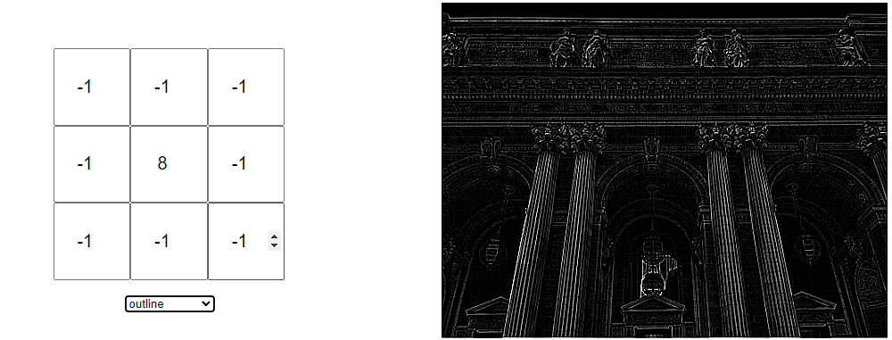

Nasze koło chętnie uczestniczy w wydarzeniach organizowanych na Politechnice Rzeszowskiej m.in. poprzez przygotowywanie stoiska z ciekawymi, interaktywnymi demami pokazującymi możliwości uczenia maszynowego. Podczas Kolażu Kół Naukowych jednym z takich dem było rozpoznawanie narysowanej cyfry.

# Wykonanie

Całą aplikację stworzyliśmy w Pythonie; jest jednym z najpopularniejszych języków używanych do analizy danych i uczenia maszynowego oraz z pomocą nieoficjalnych modułów pozawala na tworzenie prostych intefejsów.

Demo można podzielić na dwie części: model i interfejs.

## Model

Postanowiliśmy użyć konwolucyjnej sieci neuronowej; same sieci neuronowe są popularnym wyborem przy problemie klasyfikacji cyfr, a konwolucja często ułatwia zadania związane z przetwarzaniem obrazów.

### Konwolucja

Konwolucja polega na pewnego rodzaju kompresji informacji z kilku punktów(lub, jak w naszym przypadku, pikseli) za pomocą sumy ważonej:

Artykuł[^1], z którego pochodzi powyższa animacja, świetnie opisuje koncept konwolucji.

Konwolucji można użyć również do innych zastosowań niż uczenie maszynowe - przy użyciu odpowiedniej maski(tj. wag uzywanych podczas operacji sumy ważonej) można uzyskać filtr wykrywający krawędzie.

Demo[^2] ze strony *setosa.io* pozwala na eksperymentowanie z maskami konwolucyjnymi.

# Odnośniki

[^1]: [Intuitively Understanding Convolutions for Deep Learning](https://towardsdatascience.com/intuitively-understanding-convolutions-for-deep-learning-1f6f42faee1)
[^2]: [Image Kernels](https://setosa.io/ev/image-kernels/)