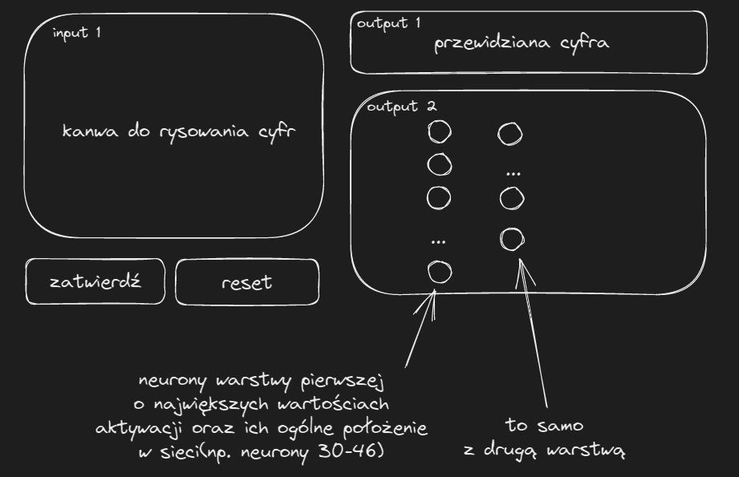

Nasze koło chętnie uczestniczy w wydarzeniach organizowanych na Politechnice Rzeszowskiej m.in. poprzez przygotowywanie stoiska z ciekawymi, interaktywnymi demami pokazującymi możliwości uczenia maszynowego. Podczas Kolażu Kół Naukowych jednym z takich dem było rozpoznawanie narysowanej cyfry.

# Wykonanie

Całą aplikację stworzyliśmy w Pythonie; jest jednym z najpopularniejszych języków używanych do analizy danych i uczenia maszynowego oraz z pomocą nieoficjalnych modułów pozawala na tworzenie prostych intefejsów.

Demo można podzielić na dwie części: model i interfejs.

## Model

Postanowiliśmy użyć konwolucyjnej sieci neuronowej; same sieci neuronowe są popularnym wyborem przy problemie klasyfikacji cyfr, a konwolucja często ułatwia zadania związane z przetwarzaniem obrazów.

### Konwolucja

Konwolucja polega na pewnego rodzaju kompresji informacji z kilku punktów(lub, jak w naszym przypadku, pikseli) za pomocą sumy ważonej:

Artykuł[^1], z którego pochodzi powyższa animacja, świetnie opisuje koncept konwolucji.

Konwolucji można użyć również do innych zastosowań niż uczenie maszynowe - przy użyciu odpowiedniej maski(tj. wag uzywanych podczas operacji sumy ważonej) można uzyskać filtr wykrywający krawędzie.

Demo[^2] ze strony *setosa.io* pozwala na eksperymentowanie z maskami konwolucyjnymi.

### Implementacja

Do zaimplementowania modelu użyliśmy biblioteki PyTorch - posiada ona zdefiniowane wastwy neuronów oraz konwolucyjne, co ułatwiło zdefiniowanie architektury.

### Trenowanie

Zgodnie z nazwą projektu, przetrenowaliśmy model na zestawie MNIST[^3]. Podczas wstępnych testów napotkaliśmy kilka problemów polegających na różnicach między zestawem uzytym do treningu a danymi, które model otrzymywał podczas testowania.

Pierwszym z nich była odwrócona paleta kolorów: zestaw MNIST zawiera obrazy cyfr narysowanych białym kolorem na czarnym tle, natomiast kanwa w naszym interfejsie stosowała odwrotną kolorystykę. Powodowało to zadowalającą dokładność modelu podczas treningu oraz słabą dokładność podczas testowania go w aplikacji. Rozwiązanie było proste - wystarczyło przetworzyć obrazek pobierany od użytkownika, odwracając na nim kolory.

Drugi problem był nieco bardziej skomplikowany. Obszar do rysowania dany użytkownikowi pozwalał mu na rysowanie cyfr dowolnej wielkości i w dowolnym miejscu (małe, duże, bliżej któregoś rogu kanwy etc.), co zmniejszało dokładność modelu(zestaw MNIST posiada cyfry o podobnej do siebie wielkości). Na szczęście członek naszego koła, Vitalii Morskyi przygotował wcześniej rozwiązanie - funkcja `prepare_image()` z repozytorium *handwritten-digits*[^4] dostosowuje obrazek do formatu bardziej przypominającego ten z zestawu treningowego naszego modelu. funkcję tą należało zastosować zarówno przy klasyfikacji, jak i przy treningu - ustandaryzowało to dane treningowe, co zwiększyło dokładność modelu.

# Interfejs
Celem interfejsu było proste pokazanie wyników naszego modelu. W tym celu postawiliśmy na szybki w wykonaniu interfejs Gradio. Wykorzystanie takiej technologi pozwala nam w szybki i prosty sposób połączyć interfejs użytkownika z kodem w pythonie. Początkowy zarys projektu zakładał trzy podstawowe komponenty:
- Kanwę, po której użytkownik może rysować wraz z przyciskami zatwierdzania
- Wyświetlanie przewidywania 
- Wyświetlanie wizualizacji sieci neuronowej

W dalszej części porzuciliśmy plan z wizualizacją sieci na rzecz prostszego interfejsu przystosowanego na urządzenia mobilne oraz zmieniliśmy technologię z Gradio na rzecz Streamlit z powodów błędów występujących przy tworzeniu kanwy.

# Odnośniki

[^1]: [Intuitively Understanding Convolutions for Deep Learning](https://towardsdatascience.com/intuitively-understanding-convolutions-for-deep-learning-1f6f42faee1)
[^2]: [Image Kernels](https://setosa.io/ev/image-kernels/)
[^3]: [MNIST-JPG](https://github.com/teavanist/MNIST-JPG)
[^4]: [handwritten-digits](https://github.com/knmlprz/handwritten-digits)