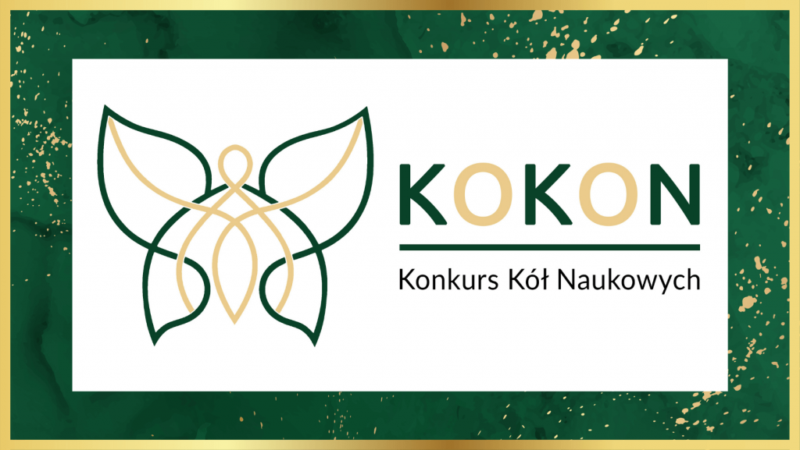
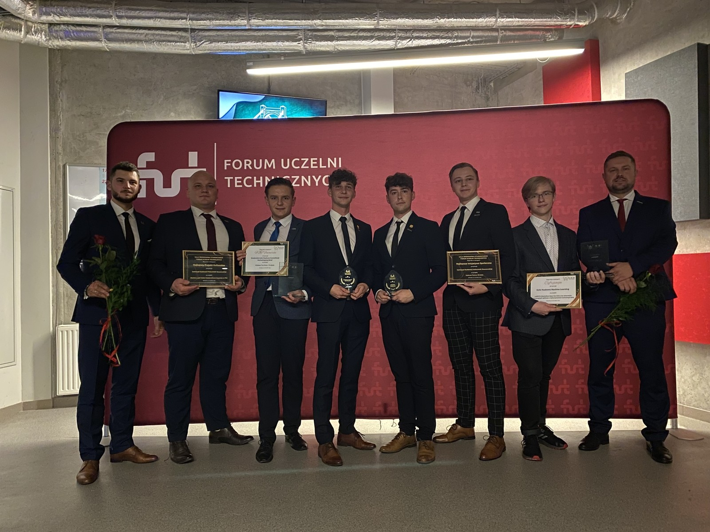
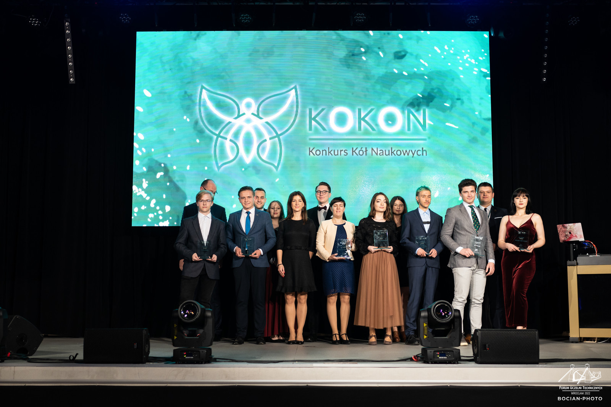

Konkurs Kół Naukowych KOKON, organizowany przez Forum Uczelni Technicznych, skierowany jest do członków i opiekunów studenckich kół naukowych, a jego cel to promocja i popularyzacja działalności kół naukowych oraz wyłonienie najlepszych tworzonych przez nie projektów. Zwycięzców w siedmiu kategoriach wybierano w głosowaniu internetowym spośród 45 zgłoszonych projektów.

**Koło Naukowe Machine Learning** **zdobyło pierwszą nagrodę w kategorii Cyfryzacja** **za projekt „LARKFiD (Hackathon Open Gov Data oraz stworzenie innowacyjnych aplikacji, z wykorzystaniem technologii GPU)”**. Nagroda ta została przyznana podczas uroczystej Gali Finałowej, która odbyła się 22 października 2022r. w Strefie Kultury Studenckiej Politechniki Wrocławskiej.

W ramach tej inicjatywy zbudowano system informatyczny pozwalający na: zautomatyzowane zbieranie informacji z mediów (w tym Twittera i Facebooka), wyodrębnienie kluczowych z nich dla danej instytucji, automatyzację procesów z użyciem sztucznej inteligencji, wysyłanie powiadomień, przeszukiwanie bazy w przystępny sposób (filtrowanie z wykorzystaniem tagów, słów kluczowych i wyszukiwanie semantyczne).

Serdecznie gratulujemy!

---

*Artykuł opublikowany pierwotnie w [aktualnościach Wydziału Matematyki i Fizyki Stosowanej PRz](https://wmifs.prz.edu.pl/aktualnosci/pierwsza-nagroda-dla-kola-naukowego-machine-learning-363.html).*
