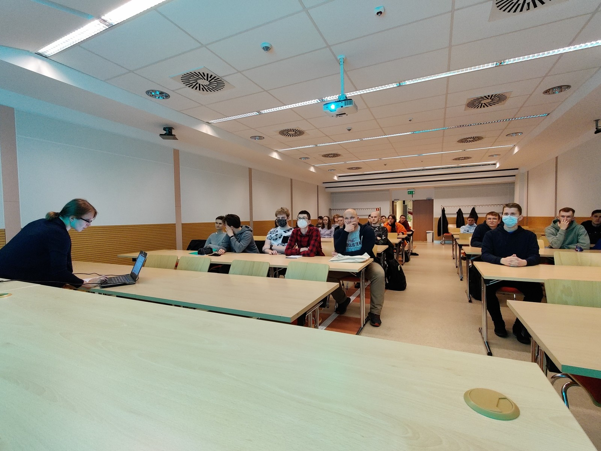
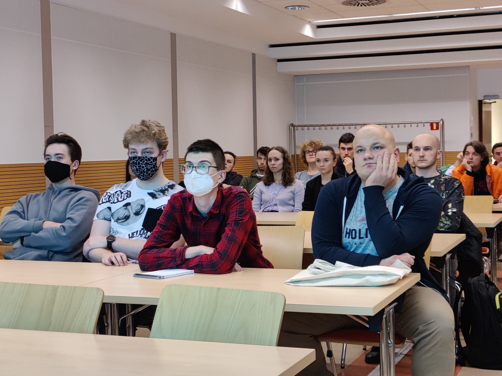
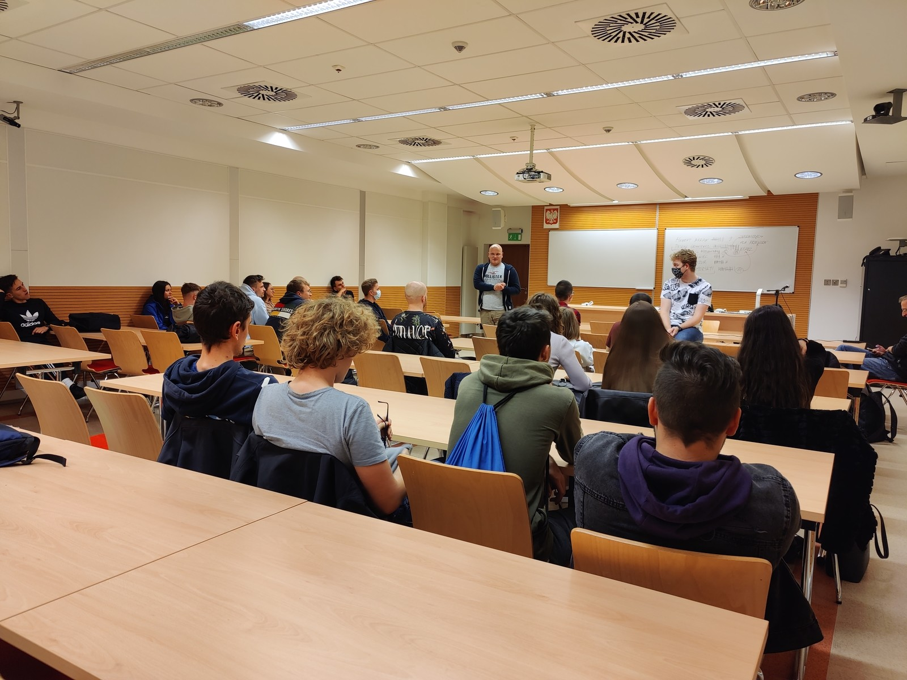
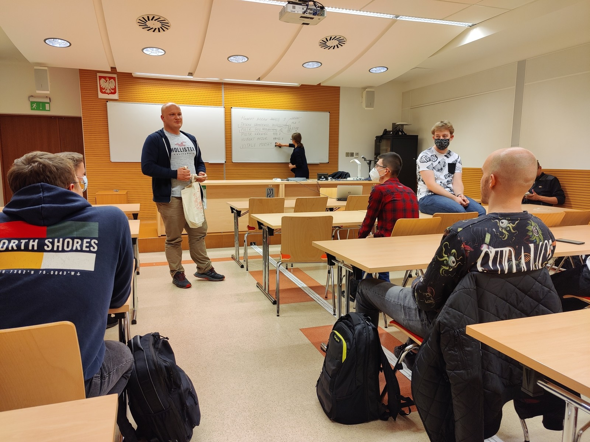

W czwartek 21 października, o godz. 17:30, odbyło się pierwsze spotkanie Koła Naukowego Machine Learning w roku akademickim 2021/2022. W spotkaniu wzięli udział zarówno dotychczasowi uczestnicy Koła ML, jak również studenci zainteresowani uczestnictwem w Kole. Podczas spotkania omówione zostały kwestie dotyczące harmonogramu zadań i wydarzeń planowanych do realizacji w semestrze zimowym r.ak. 2021/2022. Propozycje kilku bardzo ciekawych referatów/szkoleń przedstawił studentom obecny podczas spotkania mgr inż. Michał Wroński z Zakładu Systemów Złożonych, WEiI.

Ponadto podczas spotkania wybrano nowy Zarząd Koła ML na r.ak. 2021/2022. Wyniki wyborów są następujące:

- Przewodniczący - Patryk Gronkiewicz (inżynieria i analiza danych, 3 rok),
- Zastępca Przewodniczącego - Piotr Gul (inżynieria i analiza danych, 2 rok),
- Sekretarz - Vitalii Morskyi (inżynieria i analiza danych, 2 rok)

Jednocześnie zapraszamy **28 października (czwartek) o godz.19:00 do sali V5** wszystkie zainteresowane osoby na szkolenie nt.

**"Zastosowanie GPU do obliczeń kwantowo-mechanicznych w chemii oraz na co zwrócić uwagę projektując własną stację obliczeniową"**,

które poprowadzi dr inż. Karol Hęclik z Katedry Biotechnologii i Bioinformatyki PRz.

Serdecznie zapraszamy!

---

*Artykuł opublikowany pierwotnie w [aktualnościach Wydziału Matematyki i Fizyki Stosowanej PRz](https://wmifs.prz.edu.pl/aktualnosci/pierwsze-spotkanie-kola-naukowego-machine-learning-w-roku-akademickim-2021-2022-291.html).*
