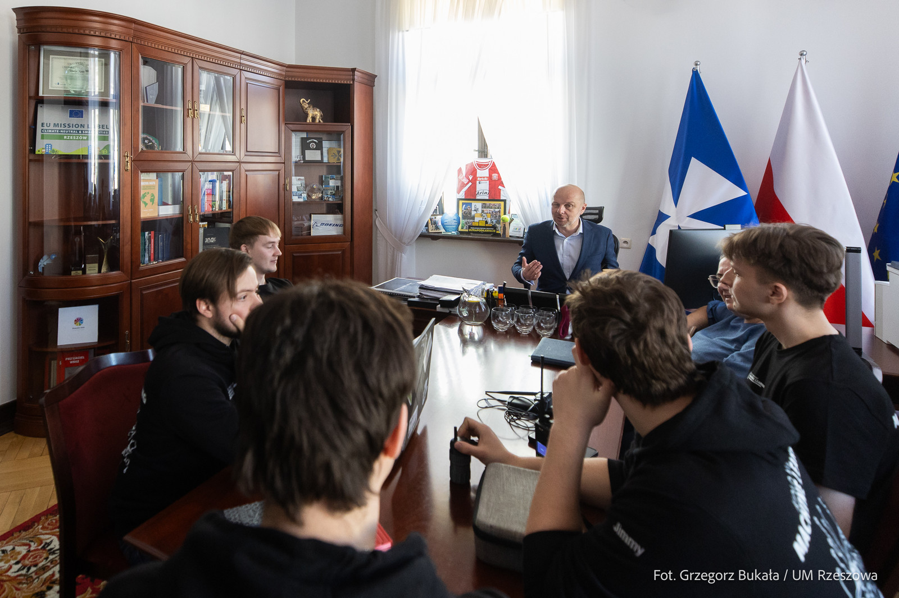
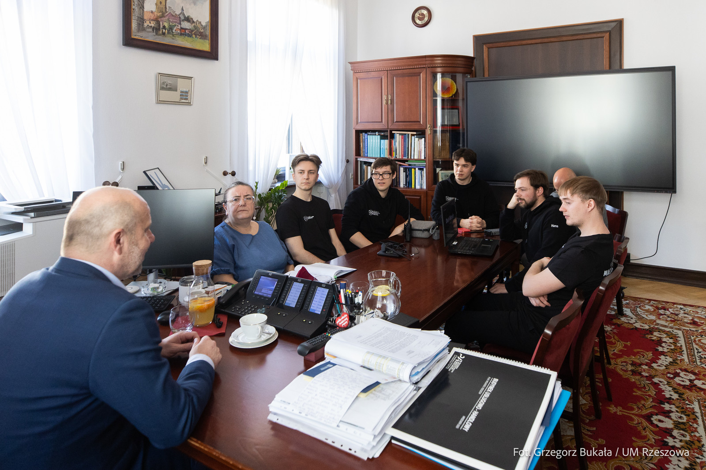
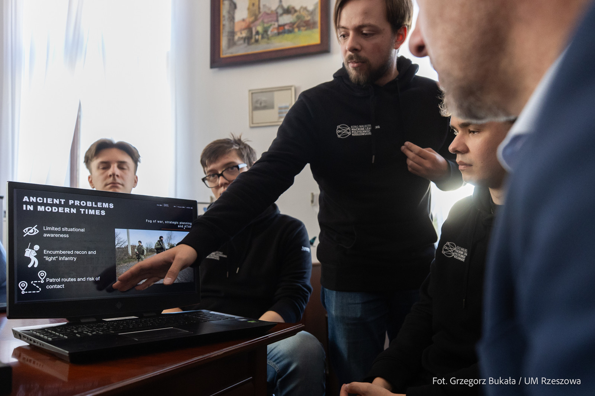
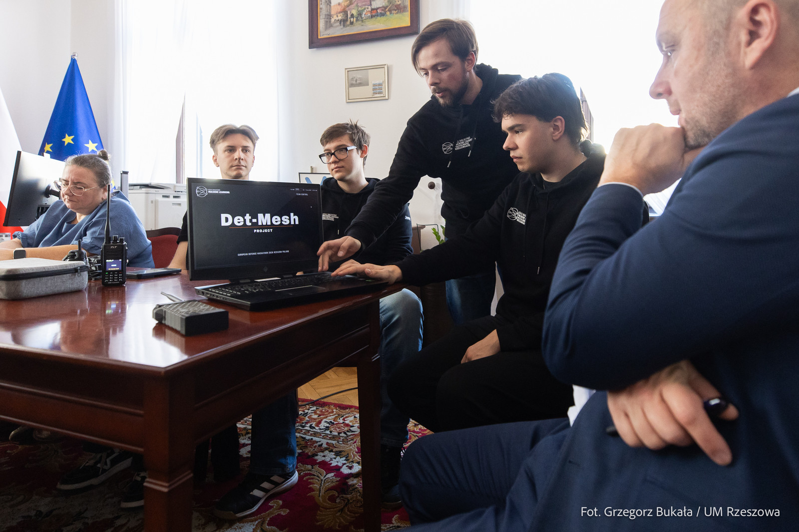

W dniu 13 marca 2026 roku Prezydent Rzeszowa, Konrad Fijołek, zaprosił do ratusza studentów z Koła Naukowego Machine Learning. Spotkanie dotyczyło zwycięskiego projektu koła, zaprezentowanego podczas hackathonu Detect & Defend, który odbył się w dniach 6–8 marca 2026 roku. W trakcie wydarzenia członkowie koła przedstawili innowacyjne rozwiązanie oparte na rozproszonej sieci radiowej, wykorzystującej wiele czujników, takich jak kamery i mikrofony. Projekt wyróżnił się na tle konkurencji i zdobył pierwsze miejsce w maratonie programistycznym.

Opracowane rozwiązanie może w przyszłości znaleźć zastosowanie m.in. w wojsku, obronie cywilnej oraz w sektorze prywatnym, wspierając wczesne wykrywanie zagrożeń ze strony dronów.

Podczas spotkania z Prezydentem omówiono perspektywy dalszego rozwoju projektu oraz możliwości jego wykorzystania w systemach zarządzania kryzysowego. W kolejnych etapach rozwiązanie mogłoby zostać zaadaptowane również do systemów komunikacji stosowanych w ochronie ludności cywilnej. Zakłada ono wykorzystanie nowoczesnych technologii do ochrony przestrzeni powietrznej oraz zapewnienia stabilnej łączności między jednostkami działającymi w terenie a centrum dowodzenia.

Twórcy projektu oparli jego koncepcję na technologiach, które można stosunkowo łatwo integrować i wdrażać. Istotnym elementem jest również lekki i mobilny sprzęt, który nie stanowi dodatkowego obciążenia dla użytkowników działających w terenie.

Prezydent zapowiedział organizację kolejnego spotkania, tym razem z udziałem przedstawicieli Wydziału Zarządzania Kryzysowego i Ochrony Ludności oraz Biura Obsługi Informatycznej i Telekomunikacyjnej. Celem rozmów będzie ocena możliwości wdrożenia proponowanego rozwiązania w systemach obrony cywilnej miasta. Planowane są także testy systemu w przestrzeni powietrznej.

Sukces studentów spotkał się z dużym zainteresowaniem branży. Zespół deklaruje dalszy rozwój projektu i obecnie prowadzone są prace badawczo-rozwojowe oraz działania mające na celu pozyskanie finansowania, które umożliwi jego przyszłe wdrożenie.

---

*Artykuł opublikowany pierwotnie w [aktualnościach Wydziału Matematyki i Fizyki Stosowanej PRz](https://wmifs.prz.edu.pl/aktualnosci/studenci-kola-naukowego-machine-learning-z-wizyta-u-prezydenta-rzeszowa-517.html).*
