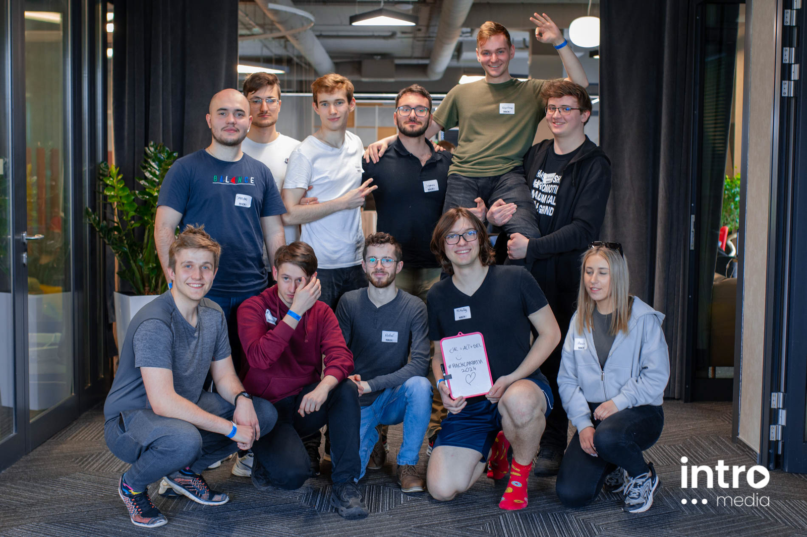
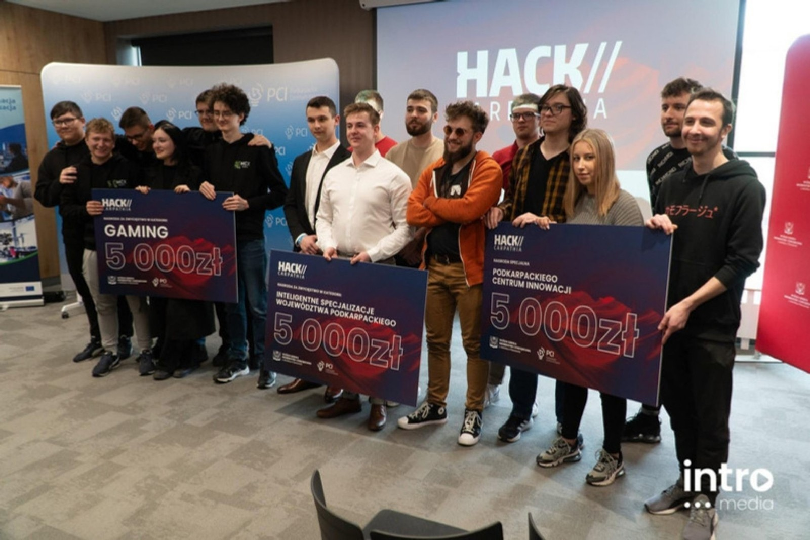

W dniach 6-7 marca 2024 r. odbył się największy rzeszowski maraton programistyczny "HackCarpathia" organizowany przez Wyższą Szkołę Informatyki i Zarządzania w Rzeszowie oraz Podkarpackie Centrum Innowacji.

W hackathonie "HackCarpathia" wzięło udział ponad 250 uczestników, ekspertów oraz mentorów. Zgłoszono 41 pomysłów: 13 w kategorii gaming oraz 28 w kategorii inteligentne specjalizacje województwa podkarpackiego. Rywalizacja trwała 24 godziny. W zawodach wzięli udział m.in. członkowie Koła Naukowego Machine Learning Politechniki Rzeszowskiej.Spośród uczestników wybrano i nagrodzono trzy najlepsze projekty.

Jeden z zespołów w składzie: **Anna Bęben, Mikołaj Data, Filip Walkowicz** z kierunku inżynieria i analiza danych (WMiFS PRz) oraz**Dawid Bis**z kierunku informatyka (WSIiZ) zdobył nagrodę specjalną Podkarpackiego Centrum Innowacji w kategorii inteligentne specjalizacje województwa podkarpackiego. Zespół zaprezentował system inteligentnego oświetlenia ulic - LAIght, analizujący obraz z kamer i aktywujący oświetlenie, gdy w pobliżu znajduje się człowiek.Wdrożenie tego systemu w przyszłości może przynieść oszczędności dla naszych miast.

Więcej informacji znajduje się na stronie [https://wsiz.edu.pl/aktualnosci/15-tysiecy-zlotych-dla-zwyciezcow-hackathonu-hackcarpathia/](https://wsiz.edu.pl/aktualnosci/15-tysiecy-zlotych-dla-zwyciezcow-hackathonu-hackcarpathia/)

Wyróżnionym serdecznie gratulujemy sukcesu !

---

*Artykuł opublikowany pierwotnie w [aktualnościach Wydziału Matematyki i Fizyki Stosowanej PRz](https://wmifs.prz.edu.pl/aktualnosci/studenci-z-kola-naukowego-machine-learning-zwyciezcami-w-hackathonie-hackcarpathia-433.html).*
