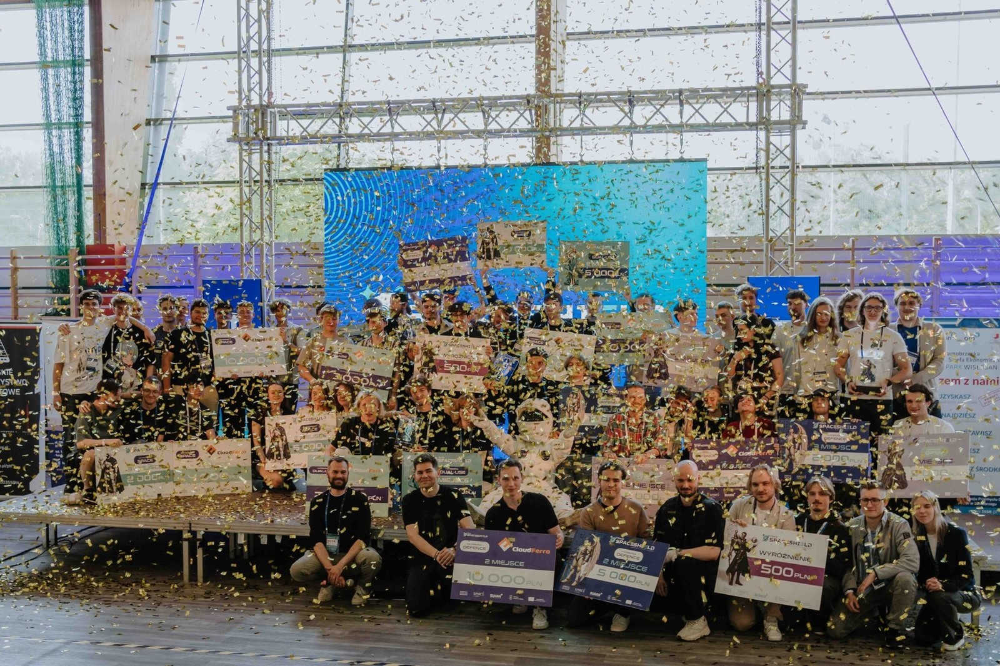
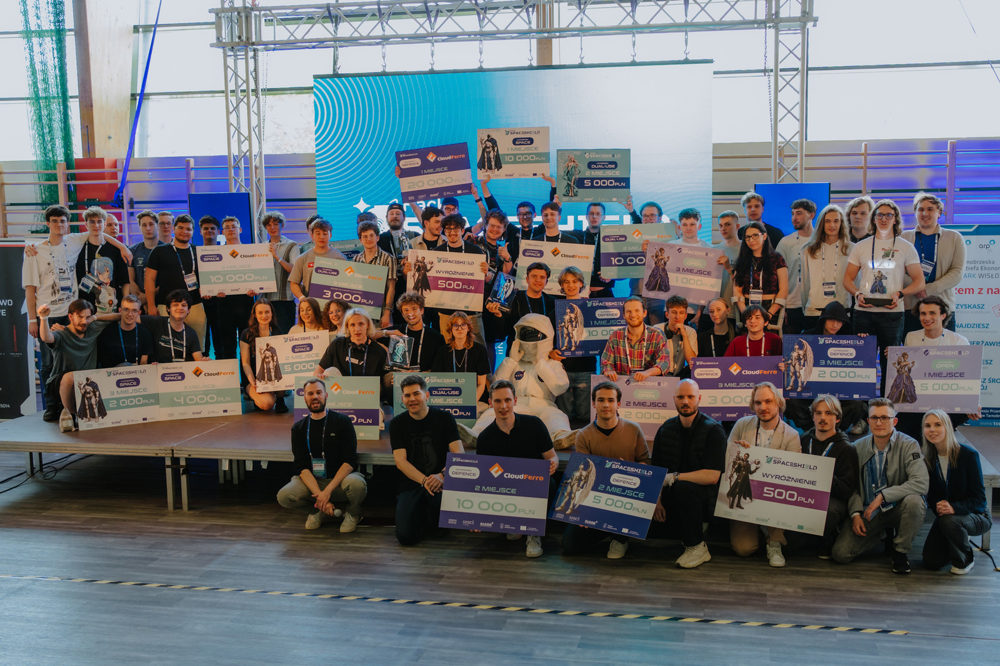

W dniach 22–23 maja członkowie Koła Naukowego Machine Learning wzięli udział w międzynarodowym hackathonie Spaceshield Hack, który odbył się w Stalowej Woli. Studenci wrócili do Rzeszowa, zdobywając pierwsze miejsce w kategorii Space!
Spaceshield Hack to wydarzenie łączące technologię z biznesem, w trakcie którego zespoły stanęły przed wyzwaniem rozwiązania zadań w kategoriach: Space, Dual-Use, Defence oraz Open. Dwa zespoły reprezentujące koło naukowe wystartowały w kategoriach Space i Dual-Use, ostatecznie triumfując w tej pierwszej.
Zwycięskie rozwiązanie miało na celu zoptymalizować stalowowolski transport publiczny z wykorzystaniem ogólnodostępnych danych satelitarnych i geoprzestrzennych. Studenci przeanalizowali miasto i okoliczne gminy pod względem dostępu do środków transportu, tworząc wnioski, prognozy i rekomendacje dla samorządów.

Ich projekt spotkał się z uznaniem jury, które przyznało im 1. miejsce. Studenci wygrali 10 tysięcy złotych oraz 20 tysięcy złotych w formie bonu na usługi firmy Cloud Ferro.

Zwycięski zespół wystąpił w składzie: Michał Wysocki (lider), Norbert Zięba, Kacper Zuba, Jakub Świątek, Mikołaj Data i Mateusz Draus.
„Jestem dumny z tego, co udało nam się osiągnąć w tak krótkim czasie. Dane wyraźnie pokazują jak wygląda w Polsce wykluczenie komunikacyjne za przykład niech posłuży miejscowość Pysznica. 9 km od Stalowej Woli. Jeden kurs MZK rano, ostatni powrót 16:45. Jeżeli spóźnisz się 15 minut - czekasz cztery godziny” – podkreśla lider zespołu.
To nie pierwsze zwycięstwo Koła Naukowego Machine Learning – jego członkowie byli już wielokrotnie doceniani na licznych maratonach programistycznych. Jeszcze w lutym tego roku wygrali hackathon EDTH Detect and Defend, po raz kolejny udowadniając swoje wysokie umiejętności w dziedzinie tworzenia oprogramowania.

Zwycięzcom gratulujemy i życzymy dalszych sukcesów!

---

*Artykuł opublikowany pierwotnie w [aktualnościach Wydziału Matematyki i Fizyki Stosowanej PRz](https://wmifs.prz.edu.pl/aktualnosci/zwyciestwo-studentow-kola-naukowego-machine-learning-w-hackathonie-spaceshield-hack-528.html).*
